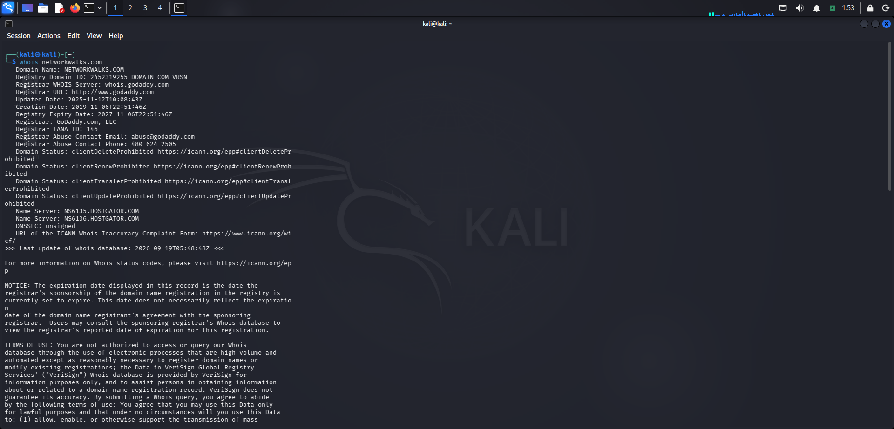
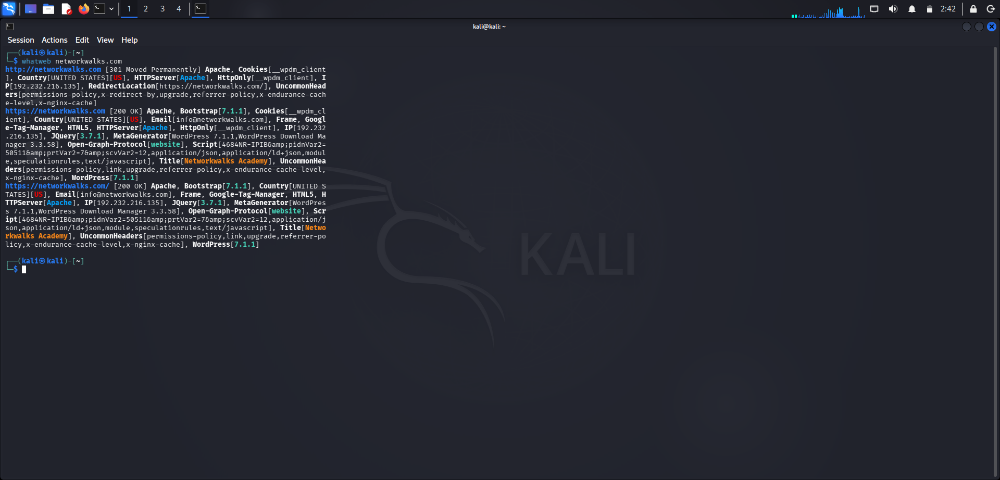
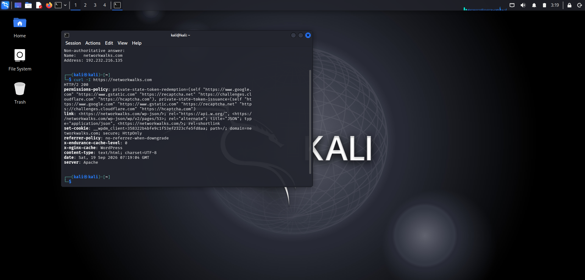
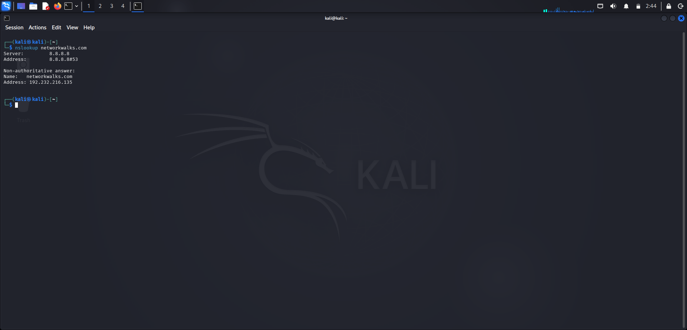
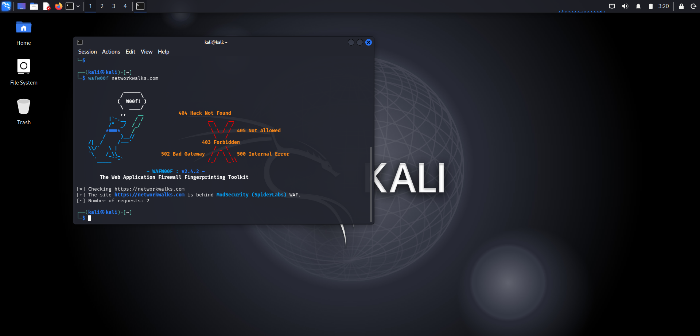
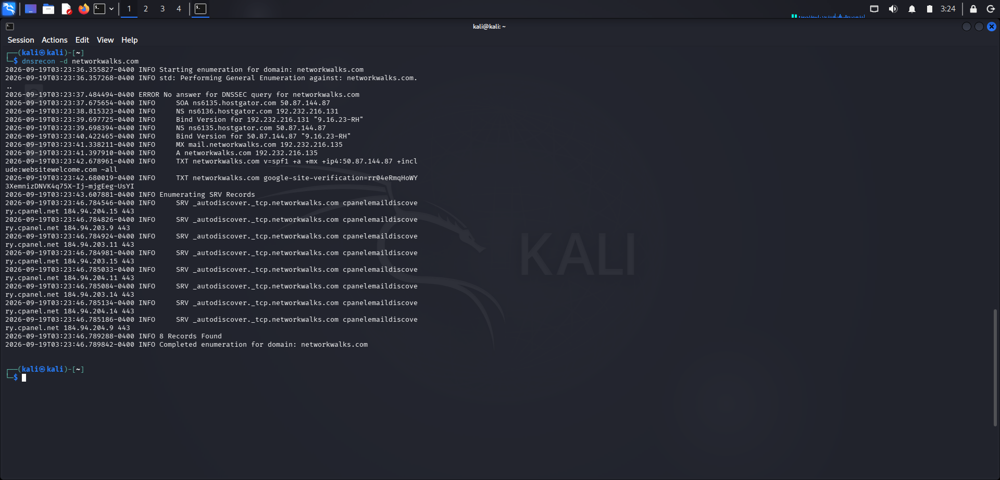
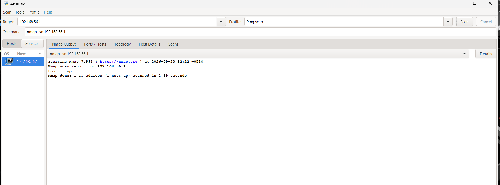

# NETWORKWALKS-B083-WK2-FOOTPRINTING-AND-SCANNING-REPORT

A comprehensive penetration testing report documenting footprinting reconnaissance on `networkwalks.com` using Kali Linux tools and local network discovery using Zenmap.

---

## Summary

Welcome to my Week 2 Cybersecurity Project repository. Building on the foundational virtual lab established in Week 1, this project explores the transition from passive reconnaissance to active network discovery. 

This report documents my end-to-end execution of **W2-PM1 (Footprinting with multiple Kali tools)**, **W2-PM5 (Zenmap-based network scanning)**, and the **W2-PM-FINAL** structured report, completed as part of the Networkwalks internship program (Batch B083).

---

## Project Scope & Target Information

* **Pentester Name:** Arulmozhi Muniraj
* **Program / Batch:** Networkwalks Cybersecurity Program (Batch B083)
* **Date:** 19 September 2026
* **Modules Completed:** 
  1. W2-PM1: Footprinting with Multiple Kali Tools (`networkwalks.com`)
  2. W2-PM5: Zenmap-based Network Scanning (`192.168.56.1`)
  3. W2-PM-FINAL: Final Comprehensive Report
* **Authorization:** Written permission secured from target owners / performed on personally owned test environments.

---

## 1. Liability Disclaimer

I have performed these activities only on the systems & devices where I had secured written permission or the devices/systems that I own myself. All these materials are for education and research purpose only. Do not use anything from here to break the law. The instructor, the authors and Networkwalks are not responsible for what you do with this knowledge. Every action you take is your own responsibility. Misuse can lead to criminal charges, heavy fines, loss of your job and a permanent record. In most countries unauthorised access is a crime even when nothing is damaged.

---

## 2. Introduction

This report covers footprinting the `networkwalks.com` domain using multiple Kali Linux tools and scanning target network spaces using Zenmap. It demonstrates how a security professional moves step-by-step from gathering public intelligence to mapping active hosts within a target infrastructure.

All commands were executed inside a controlled Kali Linux security workstation and local Windows environment. Every testing phase includes the exact command utilized, observation notes, and attacker-perspective risk impacts.

---

## 3. Tools & Utilities Used

The table below outlines each tool deployed during the Week 2 project phases and its core utility:

| Tool | Purpose & Function |
| :--- | :--- |
| **WHOIS** | Extracted public domain registration details, administrative records, and designated name servers. |
| **WhatWeb** | Fingerprinted underlying web technologies, server frameworks, content management systems, and plugins. |
| **Curl** | Inspected HTTP response headers and server configurations. |
| **Nslookup** | Resolved target domain names to their respective infrastructure IP addresses via DNS. |
| **Wafw00f** | Detected the presence of Web Application Firewalls protecting the web asset. |
| **DNSRecon** | Enumerated comprehensive DNS records (NS, MX, service, and infrastructure records). |
| **Zenmap (Nmap GUI)** | Conducted subnet discovery and host availability scans (`192.168.56.1`). |

---

## 4. Activities Performed

### Phase 1: Footprinting & Reconnaissance (`networkwalks.com`)

* **1. WHOIS Lookup:** Queried domain registrar databases to inspect domain creation history, expiration dates, and authoritative name server configurations.
  * *Evidence:* 
  >`

* **2. Technology Fingerprinting (WhatWeb):** Executed `whatweb networkwalks.com` from the Kali Linux terminal to uncover active web technologies, server headers, and content management components.
  * *Evidence:* 
  >`

* **3. HTTP Header Inspection (Curl):** Inspected HTTP response headers to view server configurations and response structures.
  * *Evidence:* 
  >`

* **4. DNS Resolution (Nslookup):** Resolved `networkwalks.com` to identify its primary server hosting IP address (`192.232.216.135`).
  * *Evidence:* 
  >`

* **5. WAF Detection (Wafw00f):** Scanned the web perimeter and successfully identified ModSecurity (SpiderLabs) filtering inbound traffic.
  * *Evidence:* 
  >`

* **6. DNS Enumeration (DNSRecon):** Mapped out broader infrastructure entries, mail exchangers, and service records linked to the target domain namespace.
  * *Evidence:* 
  >`

### Phase 2: Network Scanning & Host Discovery (Zenmap)
* **7. Zenmap Host Discovery:** Scanned target `192.168.56.1` using a Ping Scan (`nmap -sn 192.168.56.1`) to verify active host availability.
  * *Evidence:* 
  >`
  * *Additional Scan Report / Topology:* [View PDF Evidence](assets/zenmap-topology.pdf)
---

## 5. Risk Analysis & Impact Assessment

| # | Risk / Finding | Observation / Evidence | Potential Impact / Context | Risk Level |
| :---: | :--- | :--- | :--- | :---: |
| 1 | **Web Technology Exposure** | WhatWeb enumeration details | Attackers analyze exposed software versions to check for known vulnerabilities. | **Medium** |
| 2 | **HTTP Header Exposure** | Curl header inspection | Reveals server application details and response behaviors. | **Low** |
| 3 | **Server IP Address Visible** | Nslookup target resolution | Exposes the direct hosting infrastructure location of the web service. | **Low** |
| 4 | **WAF Architecture Revealed** | Wafw00f detection output | Identifies defensive layers protecting the application perimeter. | **Low** |
| 5 | **Infrastructure DNS Records** | DNSRecon data dump | Provides structural insight into corporate mail and service mapping. | **Medium** |
| 6 | **Active Host Response** | Zenmap ping scan confirmation | Establishes live node presence for further network mapping activities. | **Medium** |

* Note: Findings represent reconnaissance observations and host availability mapping; no exploitation or destructive validation was executed.

---

## 6. Recommendations & Mitigation Strategies

* **Audit Public Footprints:** Regularly review what organizational data, software versions, and technical headers are exposed to external queries.
* **Maintain Patch Compliance:** Keep all web applications, CMS platforms, and server plugins updated against current security advisories.
* **Harden DNS Configurations:** Restrict DNS zone transfers and ensure only necessary infrastructure records are publicly queryable.
* **Monitor Perimeter Defenses:** Keep Web Application Firewalls (WAF) actively tuned to deflect automated enumeration scripts.
* **Strict Authorization Protocol:** Ensure all security scanning and reconnaissance tasks remain strictly confined within authorized scopes.

---

## 7. Conclusion

During Week 2 of the Networkwalks Cybersecurity program, completing these practical modules reinforced how critical information gathering is to the preliminary stages of a security assessment. By systematically combining Kali Linux footprinting utilities with Zenmap network scans, I gained hands-on insight into how data leakage and host visibility help construct an accurate profile of a target environment—all while operating within structured, authorized boundaries.

---

## Ethical Use & Safety Disclaimer

This testing environment and reconnaissance project were constructed strictly for educational purposes, authorized security training, and professional skill development. Never execute scanning or enumeration tools against systems or domains without explicit prior written authorization.

---

## Author & Acknowledgments

* **Arulmozhi Muniraj**
* **Program:** Networkwalks Cybersecurity Program (Batch B083)
* **Institution:** SRM Institute of Science and Technology (B.Tech CSE - Cyber Security)
* **Special Thanks:** Sir Waqas Karim (CCIE) and the entire Networkwalks mentorship team for continuous guidance and structured practical challenges.
